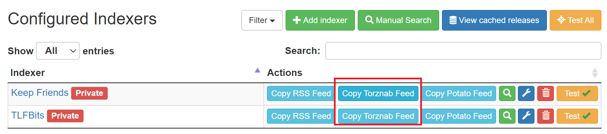

在上一篇文章中，我们介绍了[Radarr](https://radarr.video)的基本使用方法。在Radarr中，我们需要在添加BT站点之后，才能搜索下载影视资源。虽然Radarr直接支持的BT站点比较少，但借助[Jackett](https://github.com/Jackett/Jackett)，我们可以在Radarr中连接几乎所有的BT站点。本文面向Linux系统，首先介绍Jackett的安装，然后具体说明在Jackett中添加BT站点的方法，最后再介绍让Radarr使用Jackett中的BT站点的方法。

## 安装Jackett

通过`wget`命令下载Jackett。对于X64系统，

    wget https://github.com/Jackett/Jackett/releases/download/v0.20.1563/Jackett.Binaries.LinuxAMDx64.tar.gz

对于ARM64系统，

    wget https://github.com/Jackett/Jackett/releases/download/v0.20.1563/Jackett.Binaries.LinuxARM64.tar.gz

解压并复制到路径`/opt`下

    tar -xf Jackett*.Linux*.tar.gz
    sudo mv Jackett /opt

让Jackett作为系统服务运行

    cd /opt/Jackett/
    sudo ./install_service_systemd.sh

## Jackett的使用

在浏览器中，输入地址`http://<IP>:9117`进入Jackett的WEB界面，其中`<IP>`需要替换为Linux服务器的IP地址。在"Jackett Configuration"下面可以进行一些简单的设置，第一次使用建议设置一下管理密码。如下图所示，输入密码后，点击按钮"Set password"保存即可。如果网络连接不太好的话，也可以设置代理。

下面我们开始在Jackett中添加BT站点。点击页面上方的按钮"Add indexer"，在弹出的对话框中会出现支持的BT站点的列表。如图所处，我们以TLFBits为例，输入名称进行搜索。搜索完成后，点击蓝色的`Configure`按钮进行相应的账户配置。

下面左图是添加TLFBits时出现的配置页，我们填入账号、密码以及验证码后，点击"Okay"，就可以成功添加TLFBits。类似地，我们可以添加更多站点，例如FRDS。下面右图是添加FRDS时的配置页。你会发现，不同站点的配置选项可能是不一样的。添加FRDS只需要填入cookie，页面上对获取cookie的步骤进行了详细的说明，我们只需照做即可。

## 配合Radarr添加站点

把站点添加到Jackett以后，就可以在Radarr中连接这些站点了。下图是Jackett的已添加站点列表，在站点名称那一行点击按钮"Copy Torznab Feed"按钮复制连接。然后，在Radarr的页面下，点开设置->索引器，再点击页面左上方的“+”号并选择Torznab。在Torznab的设置中，我们需要填入站点名称，URL以及API Key，其中URL是刚才在Jackett中复制的链接，而API Key在Jackett页面的右上角可以看到。如下图所示，我们在Radarr中添加了TLFBits，注意在“Category”一栏里最好把和电影有关的都选上。点击保存按钮后，你就已经大功告成了，之后就可以在Radarr中搜索并下载TLFBits的电影资源了。

