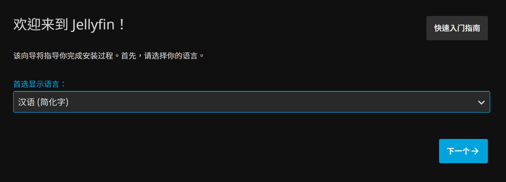
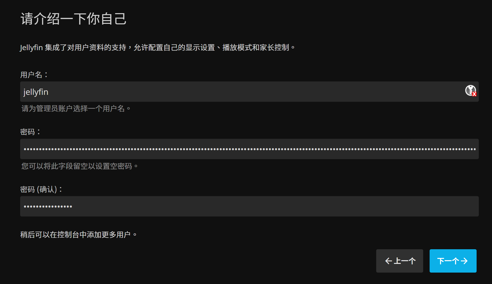
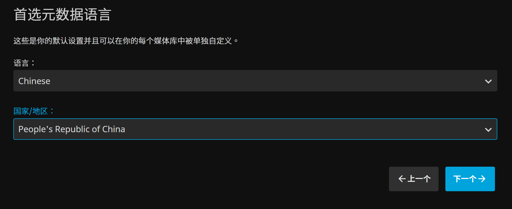
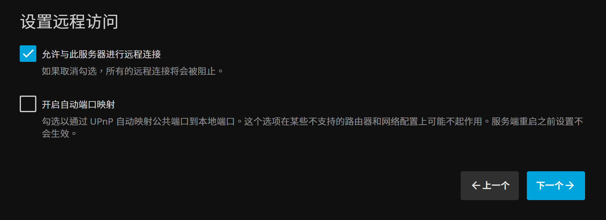
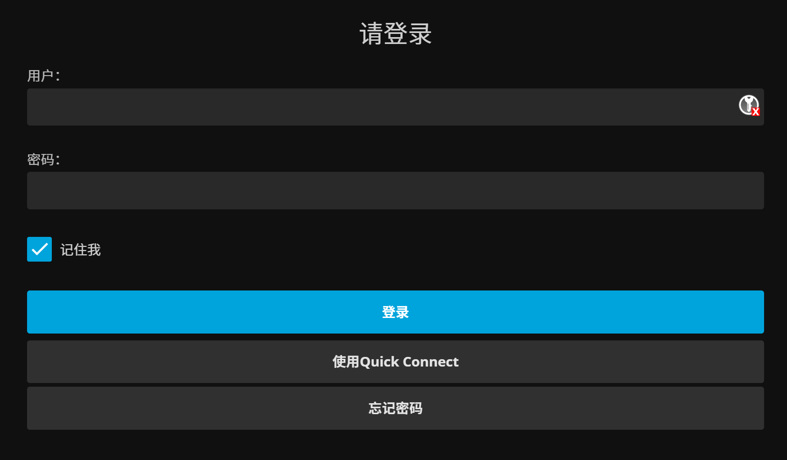
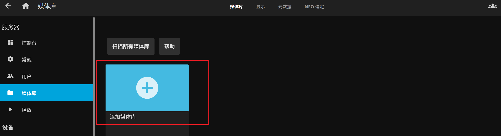
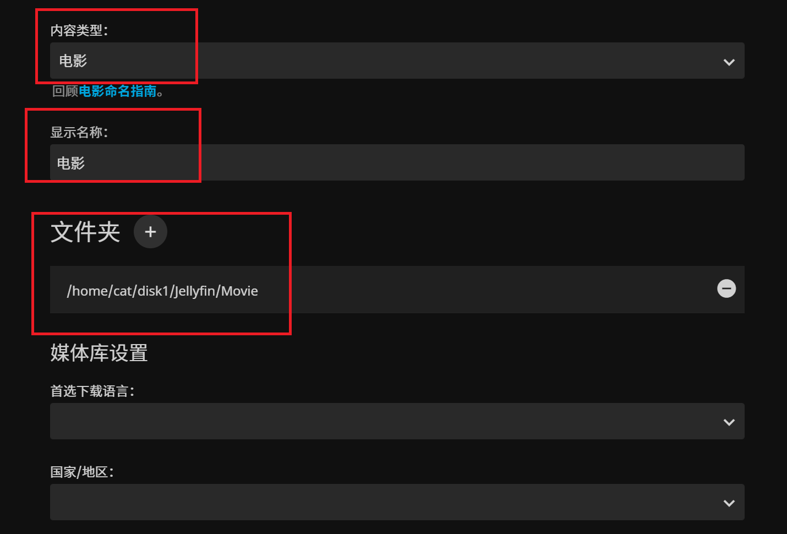
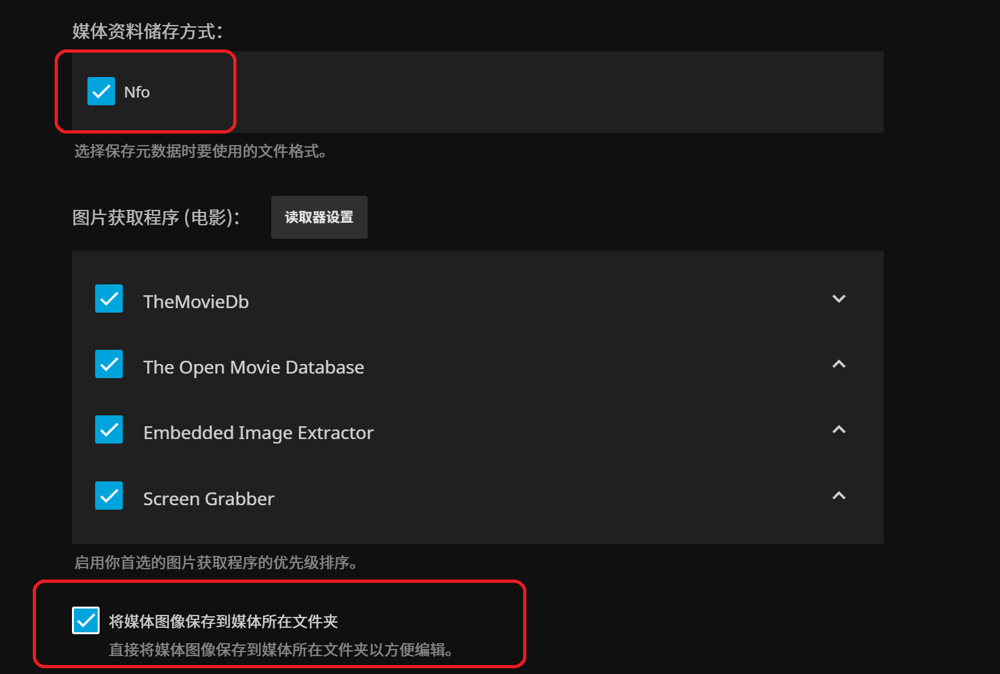
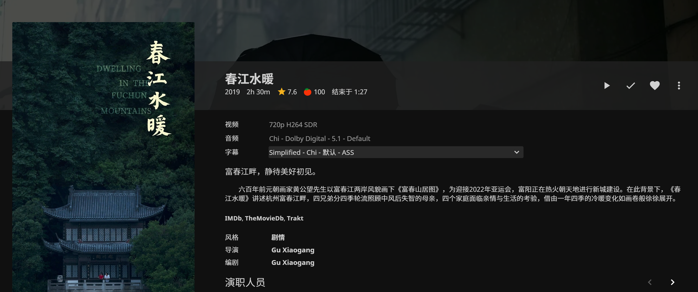

[Jellyfin](https://jellyfin.org)是一款开源的媒体管理软件，可以对本地硬盘上的电影、音乐、电子书等资源进行扫描识别整理，建立相应的媒体库。本文主要介绍使用Jellyfin管理电影资源的方法。按照本文的操作步骤，你将可以通过局域网或者互联网访问Jellyfin的Web界面，浏览电影海报，查看电影和演职员信息，并且在线播放视频。虽然Jellyfin可以直接识别硬盘上的视频文件，但是为了方便管理、提升识别正确率、避免影响做种，还是建议使用[Radarr](https://radarr.video)为视频文件建立电影目录和硬链接供Jellyfin管理，而不是直接让Jellyfin管理原始视频文件。

## 安装Jellyfin

这里介绍在Linux系统下的安装方法。首先安装`ffmpeg`。Arch Linux和Manjaro的安装命令为

    sudo pacman -S ffmpeg

使用`wget`下载Jellyfin。对于X64系统，

    wget https://repo.jellyfin.org/releases/server/linux/stable/combined/jellyfin_10.8.3_amd64.tar.gz

对于ARM64系统，

    wget https://repo.jellyfin.org/releases/server/linux/stable/combined/jellyfin_10.8.3_arm64.tar.gz

解压并复制到路径`/opt`下

    tar -xf jellyfin_10.8.3*.tar.gz
    sudo mv jellyfin_10.8.3 /opt

为了方便升级，在`/opt`目录下为Jellyfin建立一个符号连接

    sudo ln -s jellyfin_10.8.3 /opt/jellyfin

建立一个目录，用在存放Jellyfin的配置、数据、缓存以及日志等

    mkdir jellyfin

创建一个脚本，用来启动Jellyfin
    
    JELLYFINDIR=$(pwd)/jellyfin
    cat << EOF | sudo tee /opt/jellyfin/jellyfin.sh > /dev/null
    #!/bin/bash

    /opt/jellyfin/jellyfin -d $JELLYFINDIR/data -C $JELLYFINDIR/cache -c $JELLYFINDIR/config -l $JELLYFINDIR/log --ffmpeg /usr/bin/ffmpeg
    EOF
    sudo chmod 755 /opt/jellyfin/jellyfin.sh

为Jellyfin添加systemd的service

    cat << EOF | sudo tee /etc/systemd/system/jellyfin.service > /dev/null
    [Unit]
    Description=Jellyfin
    After=network.target

    [Service]
    Type=simple
    User=$USER
    Restart=always
    ExecStart=/opt/jellyfin/jellyfin.sh

    [Install]
    WantedBy=multi-user.target
    EOF

现在就可以通过systemd启动Jellyfin

    sudo systemctl -q daemon-reload
    sudo systemctl enable --now -q jellyfin

## Jellyfin的初始设置

Jellyfin服务器可以通过网页访问。在浏览器中，输入地址`http://<IP>:8096`，可以看到Jellyfin的初始设置向导，其中`<IP>`需要替换为Linux服务器的IP地址。首先，如图所示，把首选显示语言设为中文。设置好后，点击“下一个”按钮，并按照提示设置用户名和密码。接下来提示添加媒体库，我们先不添加，点击“下一个”按钮跳过。在设置元数据语言这一栏，把语言设为中文，国家设置为中国。在设置远程访问这里，点击“下一个”使用默认选项。最后会提示你设置完成，确认后可以进入Jellyfin的登录页。输入刚才设置的用户名和密码登录。

## 在Jellyfin中添加媒体库

登录后，Jellyfin的主页显示会显示一句话“这里没有可显示的内容”。那么我们就点击链接“您想现在创建一个吗？”创建我们的媒体库。点击之后，会出现下方右图所示的页面，然后再点击“添加媒体库”。

在添加媒体库的选项中，内容类型需要选择“电影”，显示名称可以根据自己的喜好设置，这里设置为“电影”。文件夹是存储视频文件的目录，这里设置为我们之前用Radarr生成硬链接的根目录。其余的选项可以参考下方图片。设置好后，点击确定即可。

添加完成后，Jellyfin会自动识别设定文件夹下的电影信息，并且联网下载电影、影人的元数据以及图片等。如果视频文件较多，这可能需要一段时间。和Radarr一样，Jellyfin需要从TMDB获取电影信息。TMDB虽然没有被墙，但是在国内受到了DNS污染，推荐使用[DNSCrypt-Proxy](https://github.com/DNSCrypt/dnscrypt-proxy)解决DNS污染问题，这样就可以正常使用Jellyfin。Jellyfin处理完成之后，进入“电影”媒体库，就可以看到已经添加的电影的海报。点击海报进入电影详情页，可以查看电影的详细信息并播放电影。

最后，除了通过网页访问Jellyfin，我们实际上也可以通过[Jellyfin的本地客户端](https://github.com/jellyfin/jellyfin-media-player)来访问Jellyfin。如果想要得到更好的视频播放体验，一定要用客户端而不是网页播放，因为浏览器支持的视频格式有限，使用浏览器播放经常需要在服务器上进行转码，可能占用较多资源并导致播放卡顿。