[Radarr](https://radarr.video)是一个针对Usenet和BT用户的电影资源管理工具，配合特定的下载工具和Jellyfin、Emby等媒体中心可以实现全自动观影。本文在Linux上安装并配置Radarr，实现同时从多个BT站搜索电影，调用qBittorrent进行下载，并在下载完成后自动创建硬链接供Jellyfin识别等功能。

## 安装Radarr

首先需要安装curl和sqlite。Debian系统可以通过包管理器安装

    sudo apt install curl sqlite3

Arch Linux和Manjaro的安装命令为

    sudo pacman -S curl sqlite3

使用`wget`下载Radarr。对于X64系统，

    wget --content-disposition 'http://radarr.servarr.com/v1/update/master/updatefile?os=linux&runtime=netcore&arch=x64'

对于ARM64系统，

    wget --content-disposition 'http://radarr.servarr.com/v1/update/master/updatefile?os=linux&runtime=netcore&arch=arm64'

解压安装到`/opt`目录下

    tar -xvzf Radarr*.linux*.tar.gz
    sudo mv Radarr /opt

添加systemd的service

    cat << EOF | sudo tee /etc/systemd/system/radarr.service > /dev/null
    [Unit]
    Description=Radarr Daemon
    After=syslog.target network.target
    [Service]
    User=cat
    Type=simple

    ExecStart=/opt/Radarr/Radarr -nobrowser
    TimeoutStopSec=20
    KillMode=process
    Restart=on-failure
    [Install]
    WantedBy=multi-user.target
    EOF

其中`User=`后面需要修改为实际的用户名。现在就可以通过systemd启动Radarr了

    sudo systemctl -q daemon-reload
    sudo systemctl enable --now -q radarr

## 对Radarr进行设置

在浏览器中，输入地址`http://<IP>:7878`，其中`<IP>`需要替换为Linux服务器的IP地址。打开网页后，我们可以看到Radarr的Web UI，并进行相应的管理和设置。

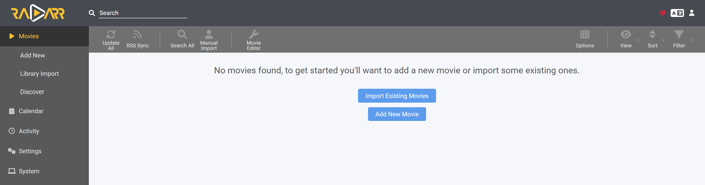

### 设置界面

点开Settings->UI设置Radarr的显示界面。默认的语言是英文，这里我们把语言设置为中文，并且对时间和日期的显示格式进行一些调整，以适应中文用户的习惯。设置好后，点击左上方的“Save Changes”保存设置，然后刷新页面，你会发现Radarr的界面已经变成了中文显示。

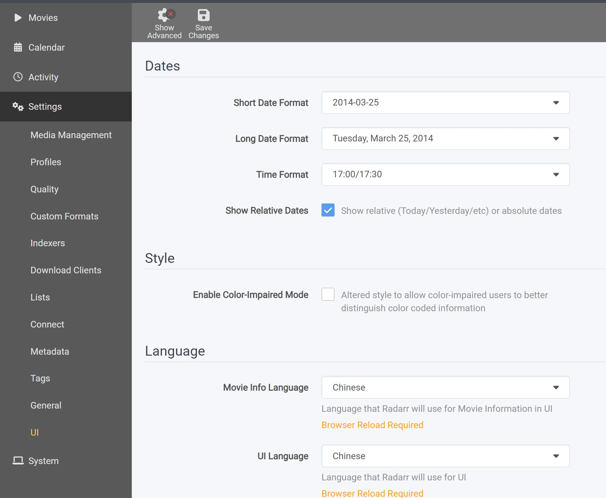

### 添加索引器

对于BT用户来说，添加索引器就是要添加BT站点，这样Radarr才能够去搜索影视资源。点开设置->索引器，然后点击页面左上方的“+”号，就会弹出添加索引器的窗口。

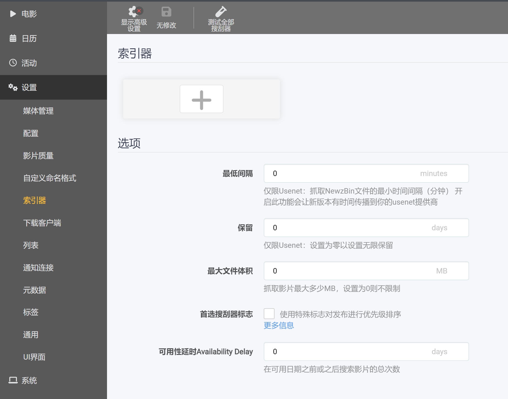
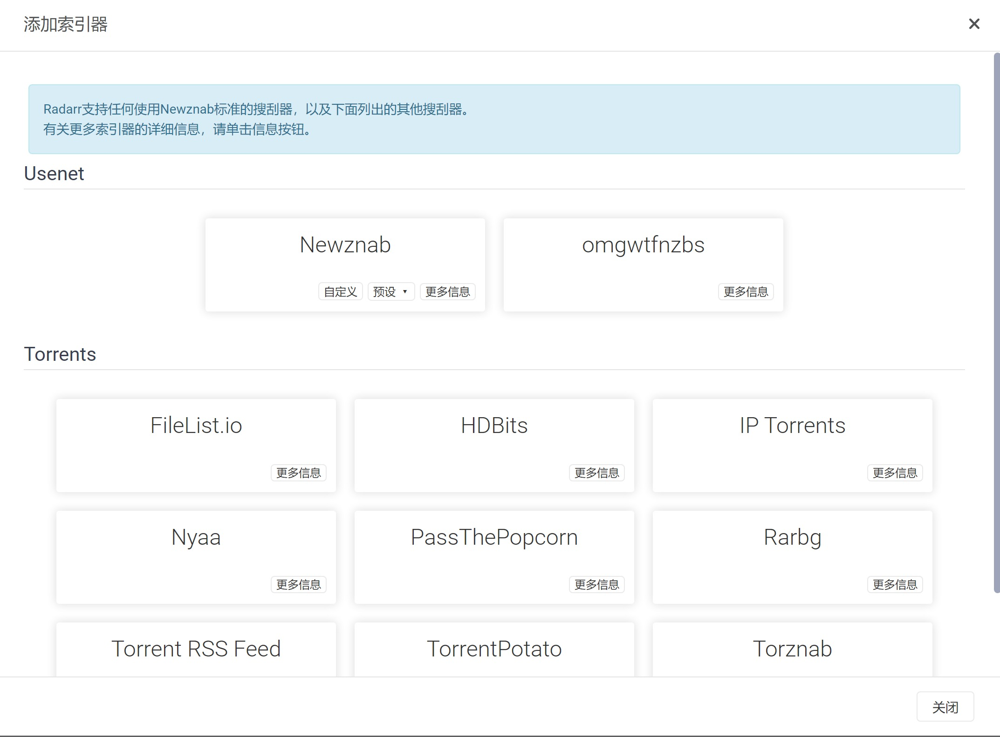

可以看到，Torrents下面列出了一些常见的BT站点。当然，我们可以添加的BT站点远不止这些。借助[Jackett](https://github.com/Jackett/Jackett)这一工具，我们可以添加现存的大多数BT站点。为了简单，这里先不介绍Jackett的使用，只添加列出的一些BT站点。我们首先尝试添加Rarbg。点击Rarbg，会出现下图的对话框，在“Category”一栏选上除了"Xxx"的所有资源分类以获得更多搜索结果，然后直接点击保存。完成之后，Rarbg就会显示在索引器列表中。

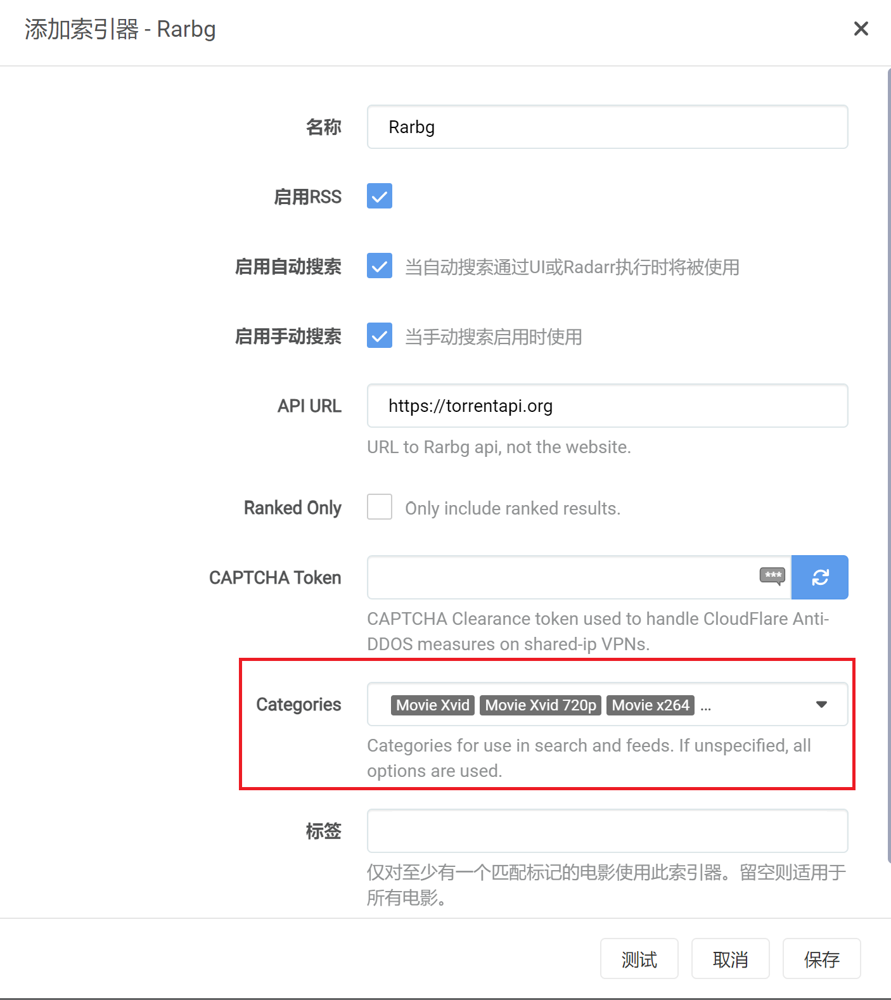
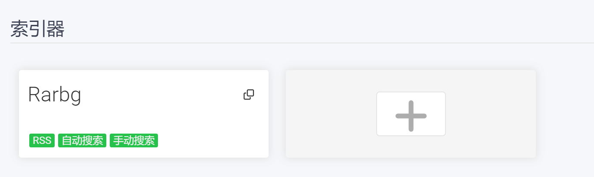

再点击“+”号可以继续添加BT站点，这里我们选择添加FileList.io。由于FileList是Private Tracker (PT)站点，我们需要注册一个账号，并填入自己的用户名和Passkey。同样地，在“Category”一栏选上除了"Xxx"的所有资源分类。

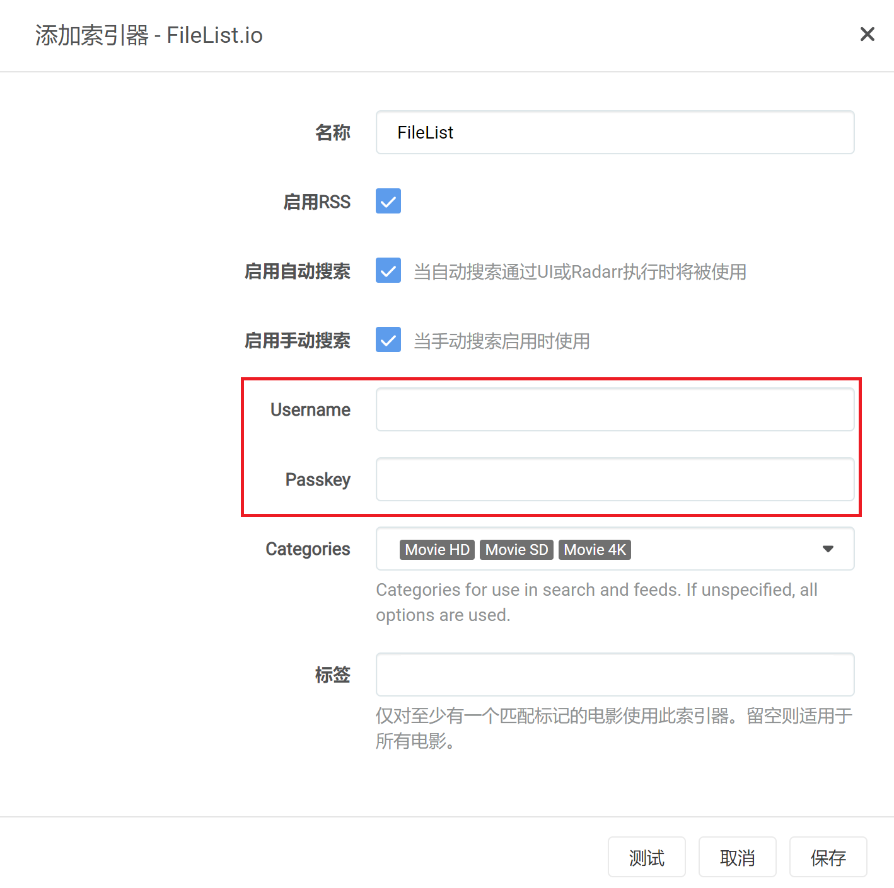


### 添加下载客户端

下面我们添加下载客户端。Radarr从BT站搜索到影视资源后，会调用我们添加的BT客户端进行下载。点开设置->下载客户端，还是点击页面左上方的“+”号，在弹出的页面中可以选择客户端的类型。因为我用的是qBittorrent，所以这里选择qBittorrent。在弹出的qBittorrent设置对话框中，设置好qBittorrent的IP地址、端口、用户名和密码，点击保存即可。注意在qBittorrent设置中，最下方有一个“移除已完成”的选项不建议勾选。

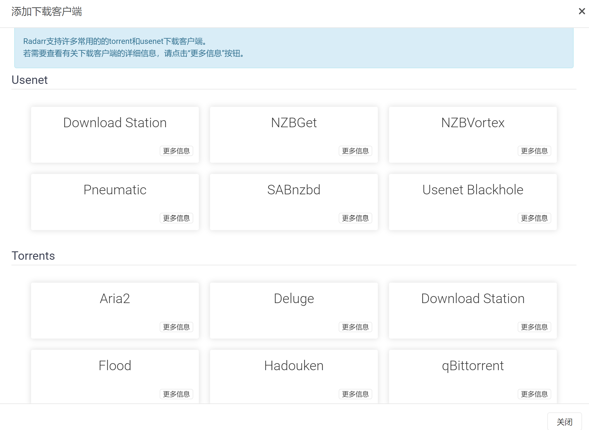
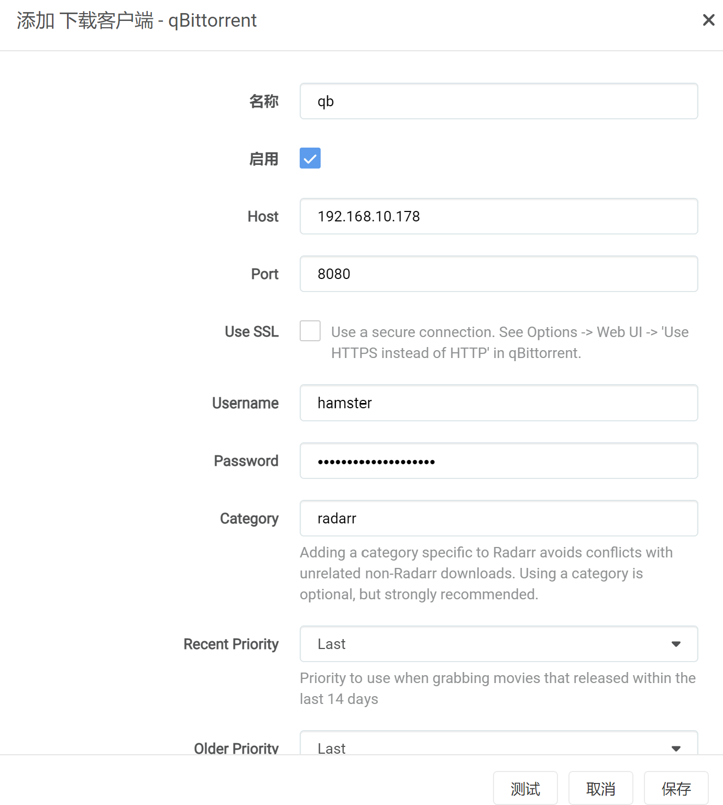

### 媒体管理

然后对媒体管理进行设置。点开设置->媒体管理，首先按照下面左图进行设置。其中，点击“添加根目录”可以添加相应目录。在Radarr中，根目录就是存放视频文件的路径，可以有多个。这里我们添加了两个，一个存放电影，一个存放纪录片。

还需要勾选上选项“重命名影片”。Radarr在下载完成后，为了方便整理，会在选定的根目录下为视频文件创建硬链接。勾选“重命名影片”后，Radarr会按照我们设置的命名规则对硬链接进行重命名，这样有助于媒体中心识别。对影片重命名的格式定义在选项“标准影片格式”中。不同的媒体中心，例如Jellyfin和Plex，它们推荐的命名方式是不同的，这里我们使用[Jellyfin推荐的电影命名方式](https://jellyfin.org/docs/general/server/media/movies.html)。为了进行设置，点击左上方“显示高级设置”，在标准影片格式中填入

```
{Movie Title} ({Release Year}) - [{Release Group} {Edition Tags} {Quality Title}]
```

然后在影片文件夹格式中填入

```
{Movie Title} ({Release Year}) [imdbid-{ImdbId}]
```

如下面右图所示。设置完成后需要保存更改。

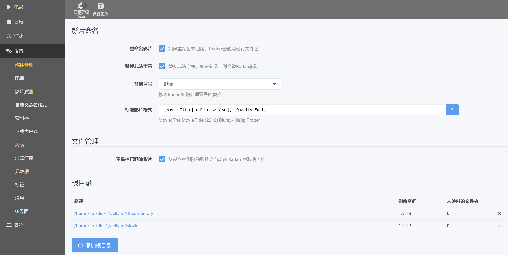
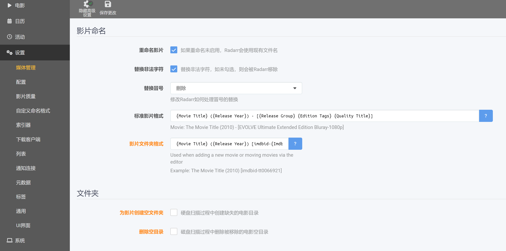

### 影片质量配置

点开设置->配置，可以对影片质量进行配置。可以发现，Radarr已经预设了几种不同的影片质量配置，包括Any、HD/720P、SD等，如下方左图所示。注意在默认设置下，影片的语言是英语，这会导致我们只能搜索到英语电影。因此，我们需要点击"Any"图标，并在弹出的对话框中，把语言从"English"修改为"Any"，如下方右图所示。修改完成后，点击保存。类似地，我们可以对HD/720P、SD等质量配置的语言进行设置。

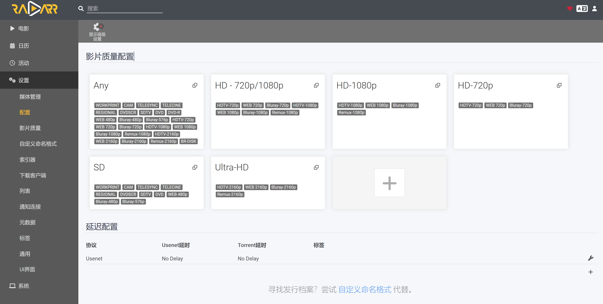
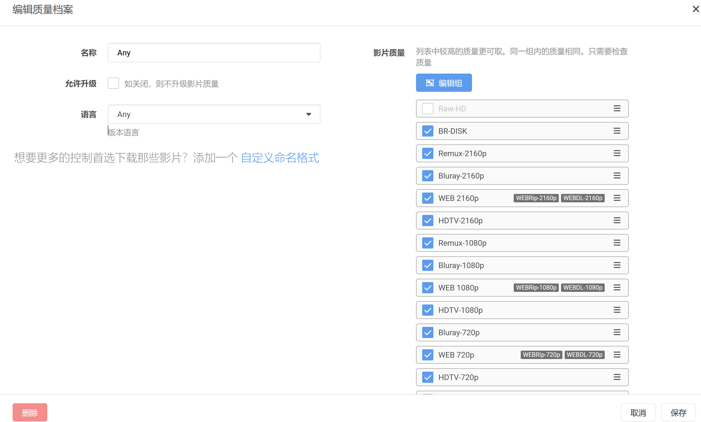

### 设置密码（可选）

如果你希望提升Radarr服务器的安全性，可以设置访问密码。点开设置->通用，在“安全”下面，按照下图进行设置，填入你的访问用户名和密码，最后点击左上角的“保存更改”。

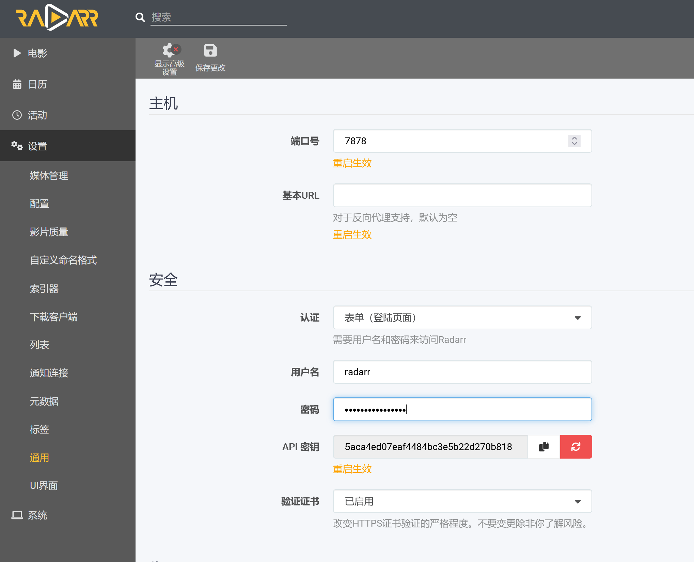

## Radarr的使用

完成Radarr的设置后，我们再对Radarr的使用方法进行介绍。Radarr的功能很多，这里只介绍最基本的使用。

### 添加电影

为了通过Radarr完成自动化下载，我们首先需要把电影添加到Radarr的媒体库。点击电影->添加电影，输入电影名称进行搜索，稍等几秒后界面上就会展示搜索结果，如下方左图所示。然而，大多数人都会遇到搜索失败的情况。这是因为，Radarr需要连接TMDB的数据库进行搜索，然而TMDB的DNS在国内被污染了。因此，为了能够使用Radarr，我们需要解决DNS污染问题。如果有条件的话可以在设置->通用里添加代理。

在搜索结果中，选中你想看的电影后，弹出的对话框中会提供一些选项，如下方右图所示。其中，根目录是创建硬链接的位置，影片质量配置是用来设置电影画质的，默认是"Any"。选项“开始搜索缺失影片”建议不选，否则Radarr会自动搜索电影资源并开始下载。最后，点击右下方的“添加电影”完成添加。

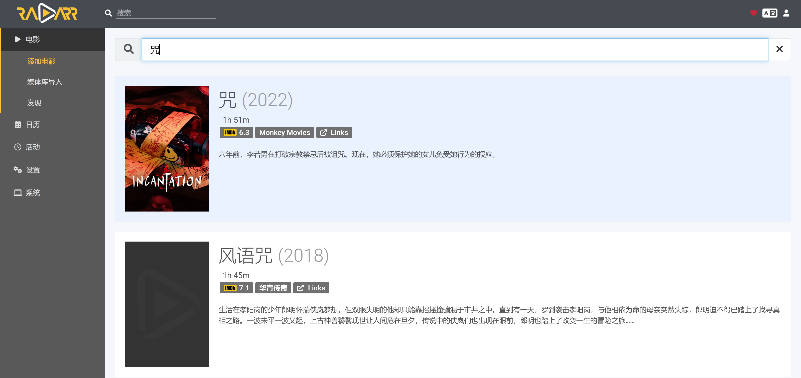
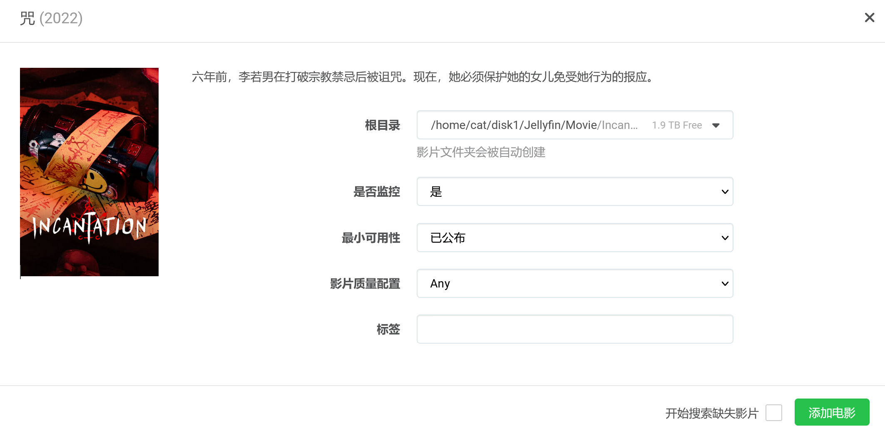

### 下载电影

在“电影”这一栏，可以看到我们添加的电影。点击电影海报，在出现的界面中，点击搜索，Radarr就会从我们添加的索引器中搜索电影资源。搜索结果中会显示视频的大小、质量以及做种人数等信息，如下方右图所示。选择一个合适的资源，点击资源名称左边的下载按钮，Radarr就会自动调用BT客户端进行下载。


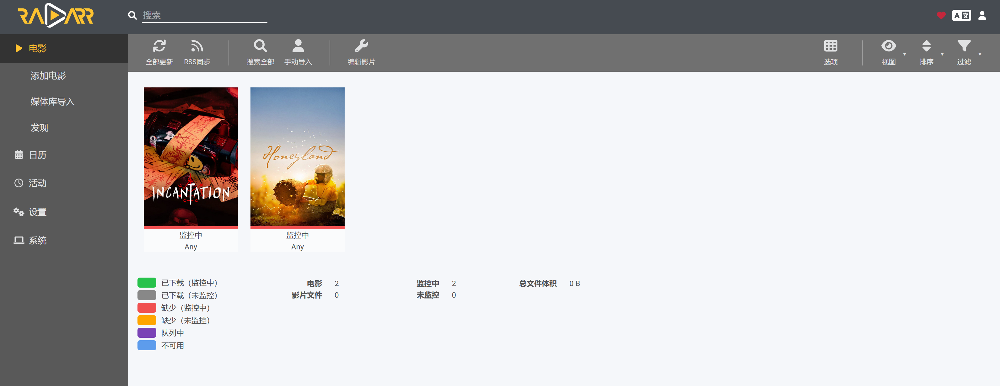
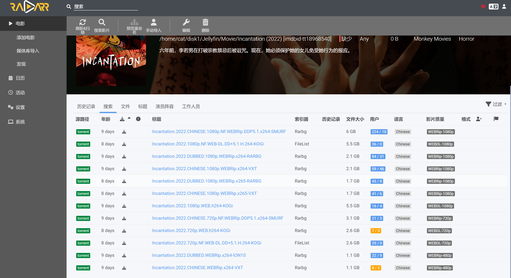

下载完成后，电影的状态会变成“已下载”，同时Radarr会自动在根目录下创建硬链接，如下图所示。如果你已经把根目录添加到Jellyfin等媒体中心的监控目录，那么媒体中心就会自动识别电影并将其添加到媒体库中。

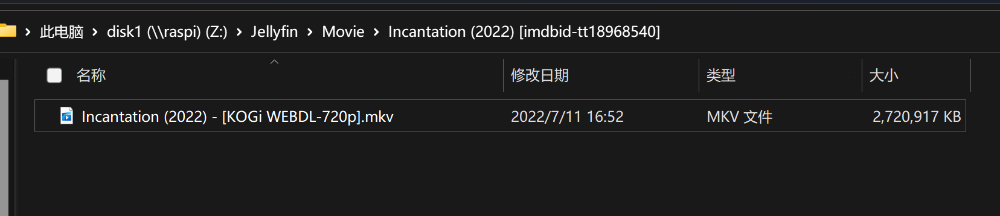